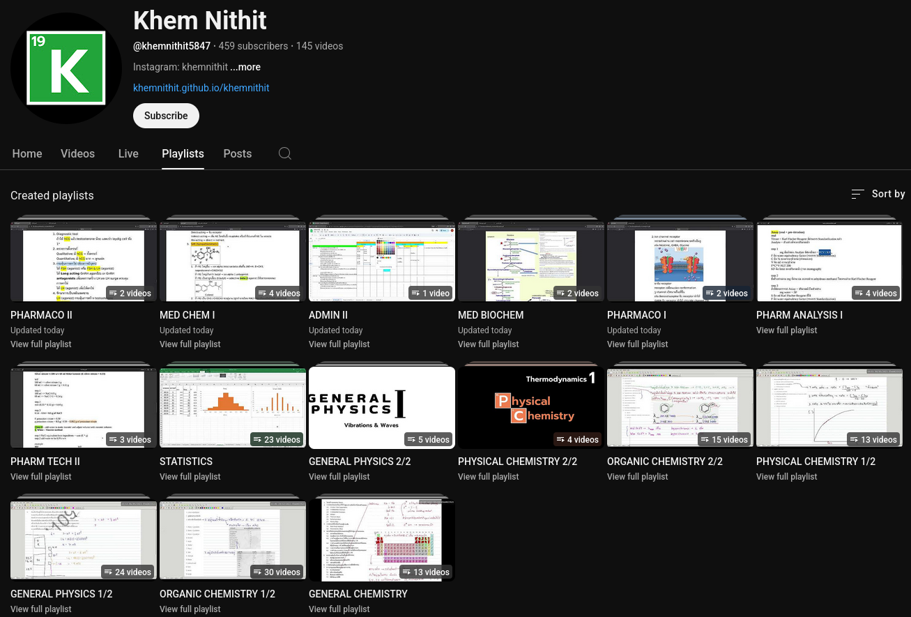

เพื่อน ๆ สามารถดูคลิปติววิชาต่าง ๆ ที่แยกไว้ด้วย playlist ได้ที่

ช่องยูทูป "Khem Nithit"

โดยชีตหรือเอกสารที่เกี่ยวข้องจะอยู่ใน link ในคำอธิบายใต้วิดีโอนั้น ๆ

---

#### Completed
วิชาที่จบแล้ว
- GENERAL CHEMISTRY FOR PHARMACY STUDENTS 
  (513108-55 เคมีทั่วไปสำหรับนักศึกษาเภสัชศาสตร์)
- PRINCIPLES OF ORGANIC CHEMISTRY 
  (513256-55 หลักเคมีอินทรีย์)
- PHYSICAL CHEMISTRY 
  (513220-55 เคมีฟิสิกัล)
- GENERAL PHYSICS FOR PHARMACY STUDENTS (514109-55 ฟิสิกส์ทั่วไปสำหรับนักศึกษาเภสัชศาสตร์)
- PHARMACEUTICAL BOTANY (566301-59 เภสัชพฤกษศาสตร์) *ไม่มีคลิป แต่มีชีต [link](https://drive.google.com/drive/folders/1dtew5V-vOd-E90UT03dh4CO41PZWmQOR?usp=sharing)*
- STATISTICS AND PHARMACEUTICAL APPLICATIONS (568351-59 สถิติและการประยุกต์ทางเภสัชศาสตร์)
- PHARMACEUTICAL TECHNOLOGY II (567302-59 เทคโนโลยีเภสัชกรรม 2)
- PHARMACEUTICAL ANALYSIS I (564302-59 เภสัชวิเคราะห์ 1)

- 564302-59 PHARMACEUTICAL ANALYSIS I  
  เภสัชวิเคราะห์ 1  

  [YouTube playlist](https://youtube.com/playlist?list=PLnbNoQ3EUjcsr8B0y--d2SXI3tQV4_uxf&si=_xxEzbVH_gOD3NAG)  
  [Notes (Google Drive)](https://drive.google.com/drive/folders/1VzUmRRa5jfERAElCVGKB3FJPYqVBm6Ts)  

- 567302-59 PHARMACEUTICAL TECHNOLOGY II  
  เทคโนโลยีเภสัชกรรม 2  

  [YouTube playlist](https://youtube.com/playlist?list=PLnbNoQ3EUjcvDW01MKUjfvzZypWD-_o-P&si=mb2nNgj2LTi1gTQf)  
  [Notes (Google Drive)](https://drive.google.com/drive/folders/1VzUmRRa5jfERAElCVGKB3FJPYqVBm6Ts)  

- 568351-59 STATISTICS AND PHARMACEUTICAL APPLICATIONS  
  สถิติและการประยุกต์ทางเภสัชศาสตร์  

  [YouTube playlist](https://youtube.com/playlist?list=PLnbNoQ3EUjctXWTCLggERaNszDXxauJ4c&si=B178R4PNijoKm5cE)  
  [Notes (Google Drive)](https://drive.google.com/drive/folders/1EmFV89f09lJ6c6Hc6vlfWnlsOLYEw1B9)  

- 514109-55 GENERAL PHYSICS FOR PHARMACY STUDENTS  
  ฟิสิกส์ทั่วไปสำหรับนักศึกษาเภสัชศาสตร์  

  [YouTube playlist 1/2](https://youtube.com/playlist?list=PLnbNoQ3EUjct3zegXFrDUCGuPOf0Z7iKg&si=HDT--wOiXi2Vdm9V)  
  [YouTube playlist 2/2](https://youtube.com/playlist?list=PLnbNoQ3EUjcvq0SeEoNkfPbjNNUwfWFfA&si=K5qJuwbnDkodGA1O)  
  [Notes (Google Drive)](https://drive.google.com/drive/folders/1ZtP8TUnAF6GsSb1OfY50iiPEhbJzOR8H)  

- 513220-55 PHYSICAL CHEMISTRY  
  เคมีฟิสิกัล  

  [YouTube playlist 1/2](https://youtube.com/playlist?list=PLnbNoQ3EUjcsdrH0InGTPQ0jTwuyDGepy&si=CJwt5lzuwP-OweTd)  
  [YouTube playlist 2/2](https://youtube.com/playlist?list=PLnbNoQ3EUjct-E01Yn_RbIc8ZdCJXbFmJ&si=deU6pNJkTX3Fi456)  
  [Notes (Google Drive)](https://drive.google.com/drive/folders/1ZtP8TUnAF6GsSb1OfY50iiPEhbJzOR8H)  

- 513256-55 PRINCIPLES OF ORGANIC CHEMISTRY  
  หลักเคมีอินทรีย์  

  [YouTube playlist 1/2](https://youtube.com/playlist?list=PLnbNoQ3EUjcvGWk1-rQRqF9Ita_GJHLJV&si=EyWN4Br_1o7jV--d)  
  [YouTube playlist 2/2](https://youtube.com/playlist?list=PLnbNoQ3EUjcttMbcBDM2LlIqPJTHBTd-C&si=Wm9ITHyp6X-fPYwq)  
  [Notes (Google Drive)](https://drive.google.com/drive/folders/1ZtP8TUnAF6GsSb1OfY50iiPEhbJzOR8H)  

- 513108-55 GENERAL CHEMISTRY FOR PHARMACY STUDENTS  
  เคมีทั่วไปสำหรับนักศึกษาเภสัชศาสตร์  

  [YouTube playlist](https://youtube.com/playlist?list=PLnbNoQ3EUjctEaEYndOiS3zNLcOHaJhzI&si=kxJdiqO0eBZOKD_N)  
  [Notes (Google Drive)](https://drive.google.com/drive/folders/1huWmfVSG9uVcJELp263cbodIV_JiiXni)  

- 566301-59 PHARMACEUTICAL BOTANY  
  เภสัชพฤกษศาสตร์

  [Notes (Google Drive)](https://drive.google.com/drive/folders/1dtew5V-vOd-E90UT03dh4CO41PZWmQOR?usp=sharing)  
  
#### New Course - coming soon
